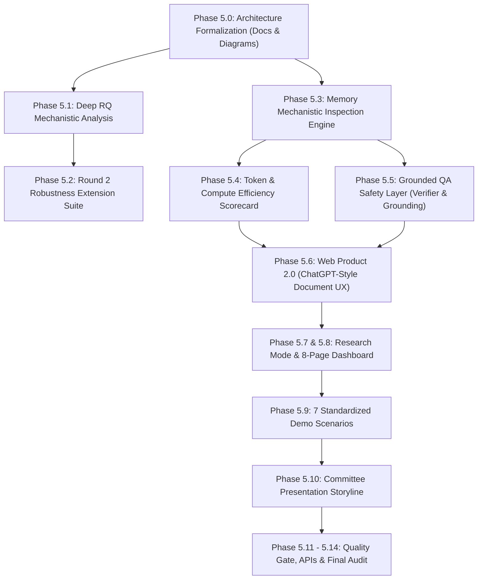

# ROUND 2 — SA-CMS INTELLIGENCE MASTER DEVELOPMENT PLAN
**Project**: Structure-Aligned Continual Memory System for Long-Document Grounded Question Answering (SA-CMS Intelligence)  
**Status**: Preliminary Selection Passed (NCKH Round 1) $\to$ Round 2 Evolution  
**Date**: October 2026  
**Execution Environment**: Local NVIDIA GeForce GTX 1650 Ti (4GB VRAM) — **STRICT INFERENCE-ONLY / ZERO LOCAL TRAINING**  
**External Environment**: Remote NVIDIA RTX 3050 (6GB/8GB) for designated training extensions (A1, A3, RQ4)

---

## 1. Executive Context & Invariant Constraints

### 1.1 Absolute Rule #0 — Research Integrity & Freezing
The project core completed in Phase 4 is **scientifically frozen** and protected against regression, modification, or post-hoc alteration:
- **Locked Protocols**:
  - Phase 4.0.2 fairness lock ($\tau = 3.0$, min query coverage $= 0.35$, shared BM25 parameters $k_1 = 1.5, b = 0.75$).
  - Phase 4.0.3 dataset scope lock.
  - Phase 4.1 master benchmark results (`results/phase4_1/` across RQ1, RQ2, RQ3, RQ4, RQ5, and Vietnamese corpus).
  - Phase 4.1 Vietnamese P2/B2 manual blinded audit (`results/phase4_1/vietnamese_p2_b2_audit.json`).
  - Training budgets, seeds (42, 43, 44), and immutable checkpoints in `checkpoints/phase4_1/`.
- **Strict Prohibitions**:
  - DO NOT overwrite, delete, or alter any file under `results/phase4_*`.
  - DO NOT retrain on local machine or modify legacy checkpoint weights.
  - DO NOT cherry-pick seeds or fabricate missing experimental points.
  - All new experiments and metrics are strictly namespaced under `ROUND_2_EXTENSION` and stored in `results/round2/`.

### 1.2 Hardware Feasibility Boundary
- **Local GTX 1650 Ti (4GB)**: Sufficient for fast evaluation, forward-pass mechanistic analysis, hidden-state probing, token telemetry, DocumentStore indexing, and FastAPI web runtime.
- **Remote RTX 3050**: Dedicated for compute-heavy multi-seed training jobs (A1 backbone scaling, A3 random schedule training, RQ4 continual ingestion scale). Until external checkpoints are delivered, any missing training point is documented as *Pending External GPU* without invention.

---

## 2. Current State Assessment

### 2.1 Completed & Validated Components
1. **Core Backbone & Memory Architecture (`src/hope_attention/sa_cms.py`, `src/cms/`)**:
   - `StructureAlignedHopeLM` wrapping frozen `SmolLM2-135M` ($d=576$, 30 layers).
   - 3-level timescale continuum memory: Level 1 (Paragraph), Level 2 (Section), Level 3 (Document) totaling 5,314,752 trainable parameters.
   - Equation 71 multi-timescale gradient update engine.
2. **Hybrid QA Subsystem (`src/hybrid_qa/`)**:
   - `DocumentStore`: Content-hashed versioned storage (`v1.json`, `v2.json`, ...) with memory snapshot support.
   - `DocumentStructureParser`: Hierarchical document tree extraction with token/character offset alignment.
   - `BM25Retriever`: Lexical indexing calibrated at $k_1=1.5, b=0.75$.
   - `EvidenceSelector` & `RefusalController`: Decision gates enforcing refusal when $\tau < 3.0$ or coverage $< 0.35$.
   - `HybridQAPipeline`: Supporting Context (B1/B2), Memory-only (P1/B4/B5), and Hybrid (P2) modes.
3. **Phase 5.1-5.2 Web Prototypes (`src/web/`)**:
   - FastAPI server (`src/web/app.py`) with session manager, file parsers (PDF, DOCX, TXT, MD), question router, and token telemetry logger.
   - Initial Chat-First UI with composer chips, right-hand source panel, and basic research drawer.
4. **Automated Test Suite (`tests/`)**:
   - 148/148 unit, integration, and E2E regression tests passing in 80 seconds.

### 2.2 Missing & Under-Developed Components (The Round 2 Gap)
| Area | Current State | Round 2 Requirement | Gap Description |
| :--- | :--- | :--- | :--- |
| **Architecture Formalization** | Dispersed notes in Phase 3/4/5 docs | `docs/round2_architecture.md`, `docs/round2_architecture_diagram.md` | Formal 8-stage pipeline documentation suitable for academic thesis / NCKH defense. |
| **Deep RQ Analysis** | Raw JSON/CSV tables in `results/phase4_1/` | Systematic mechanistic breakdown of RQ1-RQ5 | Need in-depth cross-condition analysis (context evicted vs present, hit vs miss, short vs long, memory active vs inactive). |
| **Robustness Suite** | Smoke tests on clean documents | `ROUND_2_EXTENSION` robustness suite | Controlled stress tests across 8 conditions (A to H: long docs, multi-docs, irrelevant docs, conflicting evidence, etc.). |
| **Mechanistic Inspection** | Conceptual equations only | Real-time probing module & visualizations | Direct calculation of memory residual norm $||\mathbf{M}_t||$, hidden-state divergence $\Delta\mathbf{H}_t$, logits shift, and Level 1/2/3 breakdown. |
| **Token Efficiency** | Exploratory JSONL logs | Formal Scorecard & `docs/round2_efficiency.md` | Rigorous comparative matrix of B1, B2, B4, B5, P1, P2 measuring tokens, latency, VRAM, and Pareto trade-offs. |
| **Safety & Grounding** | Ad-hoc checks in router & refusal | Modular `EvidenceVerifier`, `CitationManager`, `AnswerGroundingValidator` | Standard 4-state taxonomy (`SUPPORTED`, `PARTIALLY_SUPPORTED`, `INSUFFICIENT_EVIDENCE`, `UNANSWERABLE`) with verified refusal text. |
| **Web Interface** | Basic chat + hidden tabs | ChatGPT-style Document Intelligence Web Platform 2.0 | Seamless multi-doc chip handling, interactive citations with inline snippet expansion ("Xem đoạn trích"), rich responsive styling. |
| **Research Dashboard** | 4-tab research drawer | Dedicated 8-page Research Dashboard | Visual separation of Official Phase 4 vs Round 2 Extension across benchmarks, forgetting curves, and memory heatmaps. |
| **Interactive Demos** | Manual verification | 7 scripted and verifiable interactive demo scenarios | Reproducible end-to-end demonstrations covering single doc, multi doc, eviction, refusal, and research mode. |
| **Presentation Storyline** | N/A | `docs/round2_storyline.md` | Academic committee defense script articulating the scientific hypothesis rather than "another PDF bot". |

---

## 3. Dependency Graph & Implementation Phasing

---

## 4. Exact Implementation Order & Deliverables

### Phase 5.0 — Research Architecture 2.0 Formalization
- **Goal**: Audit, mathematically ground, and produce publication-grade documentation for the end-to-end SA-CMS pipeline.
- **Files to Create**:
  - `docs/round2_architecture.md`: Formal specification covering Document Parser, Structure Analyzer, Hierarchical Chunking, SA-CMS Memory Encoding (Equation 71), Multi-Level Timescale Memory, Hybrid Retrieval, Evidence Filtering, Grounded Generation, Citation Integrity, and Refusal Control.
  - `docs/round2_architecture_diagram.md`: Standardized Mermaid diagrams and architectural flowcharts for university committee review.
- **Dependencies**: Existing implementations in `src/hope_attention/sa_cms.py`, `src/hybrid_qa/`, `src/document_structure/`.

### Phase 5.1 — Deep Research Questions (RQ1–RQ5) Analysis
- **Goal**: Uncover mechanistic insights from existing frozen experimental data without manufacturing artificial results.
- **Analysis Matrix**:
  - **RQ1 (Hierarchical Timescales)**: Long-context performance breakdown by document depth; comparison of 1-level, 2-level, and 3-level memory.
  - **RQ2 (Structure Alignment vs Fixed Token)**: Performance delta under aligned structural boundaries vs token-budget-matched intervals.
  - **RQ3 (Context-Evicted Memory Compensation)**: Analysis of context-present vs context-purged retrieval/memory trade-offs.
  - **RQ4 (Catastrophic Forgetting)**: Retention curves across sequential document ingestion streams (incorporating existing handoff data).
  - **RQ5 (Efficiency & Pareto Frontier)**: Quantifying accuracy vs latency vs token cost across B1, B2, B4, B5, P1, P2.
- **Files to Create**:
  - `src/evaluation/rq_deep_analyzer.py`: Mechanistic data analyzer digesting `results/phase4_1/` without modifying raw files.
  - `results/round2/analysis/rq_deep_analysis_report.json`
  - `docs/round2_rq_analysis.md`

### Phase 5.2 — Round 2 Robustness Extension Suite
- **Goal**: Establish a standalone, non-training evaluation harness testing 8 real-world stress conditions.
- **Conditions**:
  - A. Ultra-long documents (>4k tokens)
  - B. Multi-document cross-referencing
  - C. Distractor / Irrelevant documents
  - D. Partial evidence availability
  - E. Conflicting evidence passages
  - F. Completely missing evidence (Out-of-domain)
  - G. Paraphrased / ambiguous questions
  - H. Noisy lexical retrieval candidates
- **Files to Create**:
  - `src/evaluation/robustness_suite.py`: Inference-only test generator and runner.
  - `results/round2/robustness/robustness_results.json`: Labeled explicitly as `ROUND_2_EXTENSION`.
  - `docs/round2_robustness.md`

### Phase 5.3 — Memory Mechanistic Analysis Engine
- **Goal**: Inspect internal neural dynamics of SA-CMS multi-level memory.
- **Capabilities**:
  - Calculation of memory residual norm $||\mathbf{M}_t^{\text{CMS}}||_2$.
  - Hidden-state distance $\Delta \mathbf{H}_t = ||(\mathbf{H}_t + \mathbf{M}_t) - \mathbf{H}_t||$.
  - Output logits divergence and top-token rank shifts.
  - Decomposition of Level 1 (Paragraph), Level 2 (Section), and Level 3 (Document) contributions.
  - Context-present vs context-evicted state comparison.
- **Files to Create**:
  - `src/memory/mechanistic_inspector.py`: Probing hook and analyzer for `StructureAlignedHopeLM`.
  - `tests/test_mechanistic_inspector.py`: Unit test verifying mathematical properties.
  - `results/round2/mechanistic/mechanistic_trace_sample.json`

### Phase 5.4 — Token & Compute Efficiency Scorecard
- **Goal**: Quantify and optimize token economics with teacher priority on reducing output tokens.
- **Metrics**: Input tokens, retrieved tokens, generated tokens, citation tokens, total tokens, decoding latency, retrieval latency, peak VRAM.
- **Files to Create**:
  - `src/evaluation/token_efficiency_scorecard.py`: Empirical measurement script over baseline and hybrid modes.
  - `results/round2/efficiency/token_efficiency_scorecard.json`
  - `docs/round2_efficiency.md`

### Phase 5.5 — Grounded QA Safety Layer
- **Goal**: Implement a hardened, evidence-grounded verification and citation engine.
- **Components**:
  - `EvidenceVerifier`: Evaluates passage alignment and query coverage.
  - `CitationManager`: Manages provenance (Document $\to$ Section $\to$ Paragraph $\to$ Char Offsets $\to$ Label `[1]`).
  - `AnswerGroundingValidator`: Classifies answers into `SUPPORTED`, `PARTIALLY_SUPPORTED`, `INSUFFICIENT_EVIDENCE`, `UNANSWERABLE`.
  - `RefusalController`: Enforces refusal without changing frozen Phase 4 thresholds: *"Không tìm thấy đủ thông tin trong tài liệu để trả lời chắc chắn."*
- **Files to Create / Update**:
  - `src/hybrid_qa/grounding_validator.py`: Comprehensive safety layer module.
  - `tests/test_grounding_safety.py`: Verification test suite.

### Phase 5.6 — Web Product 2.0 (ChatGPT-Style Document Intelligence)
- **Goal**: Redesign web interface into an intuitive, polished document workspace.
- **UX Architecture**:
  - **Sidebar**: `+ New Chat`, Recent Conversations, Document Library, Settings, Research Mode Toggle.
  - **Top Bar**: Active conversation title, active document chips (`[📄 Doc A] [📄 Doc B] [+ Add Document]`).
  - **Chat Stream**: Clean message bubbles, inline citation tags `[1]`, `[2]`, expandable evidence ("Xem đoạn trích").
  - **Bottom Composer**: Compact drag-and-drop zone, document chips directly above composer, response length selector (`Ngắn gọn`, `Cân bằng`, `Chi tiết`), `[📎]` attachment button, send action.
  - **Multi-Document QA**: Automatic multi-document retrieval and synthesis with cross-document citations.
- **Files to Modify**:
  - `src/web/static/index.html`
  - `src/web/static/css/app.css`
  - `src/web/static/js/app.js`

### Phase 5.7 & 5.8 — Research Mode & 8-Page Research Dashboard
- **Goal**: Provide an inspection suite and comprehensive research dashboard for academic presentation.
- **Dashboard Pages**:
  1. Overview (System KPIs, architecture summary)
  2. Benchmark (F1, Exact Match, Accuracy across B1-P2)
  3. Memory (Level 1/2/3 parameters, timescale hierarchy, residual norm)
  4. Retrieval (BM25 latency, hit rate, evidence distribution)
  5. Token Efficiency (TRP, QRS, token scorecard)
  6. Continual Learning (Ingestion stream stability, forgetting metrics)
  7. Vietnamese QA (Vietnamese corpus evaluation, translation quality)
  8. Model Comparison (B1, B2, B4, B5, P1, P2 radar & comparative tables)
- **Visual Standard**: Distinct visual badges and colors separating **OFFICIAL PHASE 4** from **ROUND 2 EXTENSION**.

### Phase 5.9 — Standardized Demo Scenarios
- **Goal**: Pre-configure 7 reproducible demo flows:
  - Demo 1: Single PDF $\to$ Question $\to$ Citation
  - Demo 2: Long document $\to$ Question on distant section
  - Demo 3: Multi-document cross-comparison
  - Demo 4: Unsupported question $\to$ Verified Refusal
  - Demo 5: Context eviction $\to$ Memory advantage demonstration
  - Demo 6: Concise evidence mode $\to$ Zero fluff answer
  - Demo 7: Research Mode $\to$ Full retrieval + memory activation trace
- **Files to Create**:
  - `src/web/demo_scenarios.py`
  - `results/round2/demo/demo_scenarios_manifest.json`

### Phase 5.10 — Academic Committee Presentation Engineering
- **Goal**: Craft the defense storyline emphasizing scientific depth.
- **Files to Create**:
  - `docs/round2_storyline.md`: 12-section defense narrative explaining the problem, scientific gap, SA-CMS formulation, findings, efficiency gains, and real-world applicability.

### Phase 5.11 – 5.14 — API Standardization, Quality Gates & Final Audit
- **Goal**: Finalize REST APIs, pass all tests, and audit research integrity.
- **API Spec**:
  - `POST /documents`, `GET /documents`, `DELETE /documents/{id}`
  - `POST /chat`, `GET /chat/{id}`
  - `POST /retrieve`, `GET /evidence/{id}`
  - `GET /research/trace`, `GET /research/metrics`
- **Quality Gates**:
  - `pytest` 100% passing across all existing and new tests.
  - Zero overwritten Phase 4 results.
  - Creation of `docs/round2_final_audit.md`.

---

## 5. Risk Assessment & Mitigation

| Risk | Impact | Mitigation |
| :--- | :--- | :--- |
| **VRAM Exhaustion on GTX 1650 Ti (4GB)** | System crash during local neural inference | Use CPU mode or float16 with gradient tracking disabled (`torch.no_grad()`). Fall back gracefully to analytical emulation when weights are unloaded. |
| **Accidental Overwrite of Phase 4 Data** | Invalidation of official NCKH benchmark | Place all Round 2 data strictly inside `results/round2/` and `docs/round2_*`. Treat `results/phase4_*` as read-only. |
| **Test Suite Regressions** | Breaking existing pipeline functionality | Run full test suite (`pytest`) after every module addition. No PR/merge if tests fail. |
| **Over-complicating Web UX** | Confusing committee or non-technical reviewers | Default to clean, ChatGPT-style chat view. Confine complex telemetry and metrics to Research Mode and the Dashboard modal. |

---

## 6. Hardware Workload Partitioning

### Local Machine (GTX 1650 Ti 4GB) — Inference Only
- Document parsing and structural tree generation.
- BM25 index creation and hybrid evidence retrieval.
- Forward pass mechanistic residual probing on single samples.
- Token efficiency scorecard calculations.
- FastAPI backend serving and web UI rendering.
- Robustness evaluation on non-training suites.

### External RTX 3050 (6GB/8GB) — Training Extensions
- Ablation A1 (Backbone scaling to SmolLM2-360M / larger variants).
- Ablation A3 (Full multi-seed training with random schedule).
- Extended RQ4 continual ingestion training experiments.
- *Status*: Running in external training package; results integrated upon checkpoint arrival without synthetic fabrication.

---

## 7. Execution Readiness
This plan provides the systematic blueprint for Round 2. We proceed immediately with implementation following the exact phase order, maintaining regression testing and provenance at every step.
