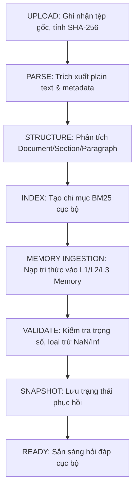

# KIẾN TRÚC LƯU TRỮ VÀ VÒNG ĐỜI BỘ NHỚ CỤC BỘ (OFFLINE MEMORY PERSISTENCE ARCHITECTURE)
## HỆ THỐNG SA-CMS (STRUCTURE-ALIGNED CONTINUAL MEMORY SYSTEM)
*Phiên bản: 1.0 — Chuẩn nghiên cứu NCKH & Nested Learning (arXiv:2512.24695v1)*
*Trạng thái: OFFLINE-READY | BẢO TOÀN TÍNH TOÀN VẸN KHOA HỌC*

---

## 1. KIẾN TRÚC LƯU TRỮ CỤC BỘ (LOCAL STORAGE ARCHITECTURE)

Hệ thống SA-CMS tuân thủ nguyên tắc cách ly tuyệt đối bốn thành phần lưu trữ cục bộ. Bốn thành phần này giải quyết các chức năng khác nhau trong pipeline và **không được phép đồng nhất với nhau**:

```
                       USER APPROVED CORPUS
                                 │
         ┌───────────────────────┴───────────────────────┐
         ▼                                               ▼
┌──────────────────┐                            ┌──────────────────┐
│  A. ORIGINAL     │                            │   B. PARSED      │
│  DOCUMENT        │                            │   DOCUMENT       │
│  (local_runtime/ │                            │  (local_runtime/ │
│   documents/)    │                            │   parsed/)       │
└────────┬─────────┘                            └────────┬─────────┘
         │                                               │
         ▼                                               ▼
┌──────────────────┐                            ┌──────────────────┐
│  C. RETRIEVAL    │                            │   D. SA-CMS      │
│  INDEX (BM25)    │                            │   MEMORY STATE   │
│  (local_runtime/ │                            │  (local_runtime/ │
│   indexes/)      │                            │   checkpoints/)  │
└──────────────────┘                            └──────────────────┘
```

### 1.1. Bốn Phân Hệ Lưu Trữ Cục Bộ
1. **A. ORIGINAL DOCUMENT (`local_runtime/documents/`)**:
   - Tệp nguyên bản do người dùng tải lên (PDF, DOCX, TXT, MD, JSON).
   - Bảo toàn nguyên trạng byte-level để tính SHA-256 và phục vụ kiểm tra nguồn gốc pháp lý/học thuật.
2. **B. PARSED DOCUMENT (`local_runtime/parsed/`)**:
   - Cây cấu trúc phân cấp tài liệu được trích xuất (Document -> Section -> Paragraph).
   - Chứa tọa độ ký tự (`start_char`, `end_char`) và token boundaries cho từng nhịp cập nhật bộ nhớ.
3. **C. RETRIEVAL INDEX (`local_runtime/indexes/`)**:
   - Chỉ mục BM25 cục bộ phục vụ trích xuất bằng chứng đối chiếu (evidence retrieval).
   - Đảm nhiệm vai trò grounding, trích xuất đoạn văn cụ thể để kiểm tra tính trung thực.
4. **D. SA-CMS MEMORY STATE (`local_runtime/checkpoints/memory/` & `local_runtime/snapshots/`)**:
   - Trọng số bộ nhớ tham số hóa (parametric memory weights) tích lũy tri thức qua các nhịp cập nhật cấu trúc.
   - Hoàn toàn độc lập với chỉ mục từ khóa và tệp văn bản.

### 1.2. Thư Mục Chuẩn Authoritative `local_runtime/`
```
local_runtime/
├── model/                  # Trọng số backbone SmolLM2-135M cố định (config.json, safetensors)
├── tokenizer/              # Tokenizer cục bộ (tokenizer.json, vocab.json, merges.txt)
├── checkpoints/
│   ├── approved_model/     # Bản sao/link cấu hình backbone chính thức
│   └── memory/             # Checkpoint bộ nhớ SA-CMS (cms_3lvl_seed_42.pt)
├── documents/              # Tệp tài liệu gốc người dùng cung cấp
├── parsed/                 # JSON cấu trúc phân cấp (sections, paragraphs, token boundaries)
├── indexes/                # Chỉ mục BM25 serialized và mapping đoạn văn
├── snapshots/              # Snapshot bộ nhớ (.pt) và siêu dữ liệu snapshot (.json)
└── metadata/               # Manifests, audit logs và bảng băm toàn vẹn SHA-256
```

---

## 2. VÒNG ĐỜI TÀI LIỆU (DOCUMENT LIFECYCLE)

Mỗi tài liệu đưa vào hệ thống phải trải qua quy trình 8 bước nghiêm ngặt:

$$\text{UPLOAD} \rightarrow \text{PARSE} \rightarrow \text{STRUCTURE} \rightarrow \text{INDEX} \rightarrow \text{MEMORY INGESTION} \rightarrow \text{VALIDATE} \rightarrow \text{SNAPSHOT} \rightarrow \text{READY}$$



### 2.1. Trạng Thái Vòng Đời (Document Status Transitions)
- `UPLOADED`: Tệp gốc đã lưu tại `local_runtime/documents/`, băm SHA-256 hoàn tất.
- `PARSED`: Văn bản thô đã trích xuất thành công.
- `INDEXED`: Các đoạn văn (passages) đã được lập chỉ mục BM25.
- `INGESTED_TO_MEMORY`: Trọng số SA-CMS đã hấp thụ tri thức cấu trúc của tài liệu.
- `READY`: Bộ nhớ đã vượt qua kiểm tra toàn vẹn trọng số và tạo snapshot sao lưu an toàn.
- `FAILED`: Xảy ra lỗi tại bất kỳ bước nào; hệ thống lập tức hủy bỏ và rollback.

*Nguyên tắc nghiêm ngặt: Tuyệt đối không đánh dấu tài liệu là `READY` khi chỉ mới lưu tệp gốc.*

---

## 3. VÒNG ĐỜI BỘ NHỚ (MEMORY LIFECYCLE)

Hệ thống bảo toàn tuyệt đối kiến trúc 3 cấp độ bộ nhớ theo đề xuất NCKH và Nested Learning:

| Cấp độ | Tên gọi | Phạm vi cấu trúc | Chu kỳ cập nhật | Chức năng biểu diễn |
| :--- | :--- | :--- | :--- | :--- |
| **L1** | Paragraph Memory | Đoạn văn bản | Tần số cao (High-frequency) | Nắm bắt chuyển tiếp cục bộ, thực thể và vi cú pháp |
| **L2** | Section Memory | Đề mục / Chương | Tần số trung bình (Intermediate) | Duy trì tính mạch lạc chủ đề và ngữ cảnh chuyên mục |
| **L3** | Document Memory | Toàn bộ tài liệu | Tần số thấp (Coarse-frequency) | Neo giữ ngữ nghĩa tổng thể và mục tiêu tài liệu |

### 3.1. Tính Độc Lập Giữa Nền và Bộ Nhớ
- **Backbone (`SmolLM2-135M`)**: Cố định hoàn toàn (Frozen). Không cập nhật trọng số backbone khi nạp tài liệu.
- **Bộ nhớ (`SA-CMS Adapters`)**: Cập nhật tham số theo từng nhịp cấu trúc dựa trên thuật toán Continual Memory System.

---

## 4. VÒNG ĐỜI CHECKPOINT (CHECKPOINT LIFECYCLE)

Trạng thái checkpoint bộ nhớ được quản lý trong `local_runtime/metadata/memory_manifest.json`:

- `PENDING`: Checkpoint đang chờ nạp hoặc đang chờ huấn luyện trên GPU ngoại vi.
- `VALID`: Checkpoint đã được kiểm tra SHA-256, nạp thành công vào mô hình và không chứa NaN/Inf.
- `INVALID`: Checkpoint bị sai lệch SHA-256 hoặc lỗi tensor.
- `SUPERSEDED`: Checkpoint hợp lệ cũ đã được thay thế bởi checkpoint tích lũy mới hơn.

### Phân Biệt Rõ Ràng Trạng Thái Checkpoint Hiện Tại
1. **Checkpoint Thực Nghiệm Hiện Tại (Phase 4.1)**:
   - Tệp: `local_runtime/checkpoints/memory/cms_3lvl_seed_42.pt` (Kích thước: 20.3 MB).
   - Trạng thái: `VALID (CURRENT_VALID_CHECKPOINT)`.
2. **Checkpoint Huấn Luyện GPU Ngoại Vi Cuối Cùng**:
   - Trạng thái: `PENDING EXTERNAL GPU`.
   - Tuyệt đối không tự ý ngụy tạo hay tuyên bố đã hoàn thành checkpoint cuối trước khi chạy thực nghiệm GPU chính thức.

---

## 5. VÒNG ĐỜI SNAPSHOT (SNAPSHOT LIFECYCLE)

Để ngăn chặn việc ghi đè phá hủy bộ nhớ khi nạp tài liệu mới, hệ thống áp dụng cơ chế **Pre-Ingestion Snapshotting**:

1. Trước khi bắt đầu nạp tài liệu mới: Hệ thống tự động snapshot trạng thái bộ nhớ hiện tại (`snapshots/{snapshot_id}.pt`).
2. Ghi nhận metadata snapshot vào `local_runtime/metadata/snapshot_history.json`:
   - `snapshot_id`: Định danh duy nhất (UUID/Timestamp).
   - `previous_snapshot_id`: Chuỗi liên kết lịch sử.
   - `document_ids_before` & `document_ids_after`.
   - `checkpoint_sha256`: Băm kiểm tra toàn vẹn.
   - `timestamp`: Thời điểm tạo.
3. Nếu quá trình nạp thất bại hoặc kiểm tra tính toàn vẹn phát hiện lỗi: Kích hoạt Rollback tự động về snapshot trước đó.

---

## 6. VÒNG ĐỜI CHỈ MỤC TRÍCH XUẤT (RETRIEVAL / INDEX LIFECYCLE)

- Chỉ mục BM25 được xây dựng tự động từ các đoạn văn bản (passages) trong `local_runtime/indexes/`.
- Khi người dùng hỏi đáp:
  - Chỉ mục BM25 trích xuất top bằng chứng cục bộ.
  - Bộ điều khiển từ chối (`RefusalController`) xác định ngưỡng tin cậy điểm số bằng chứng (ngưỡng 3.0, độ bao phủ tối thiểu 35%).
- **Phân định khoa học**: Hệ thống hiển thị rõ ràng trên giao diện:
  - Đóng góp từ bộ nhớ SA-CMS: `AVAILABLE`
  - Bằng chứng đối chiếu cục bộ: `AVAILABLE`
  - *Tuyệt đối không đánh đồng "tìm thấy trong văn bản" với "mô hình đã ghi nhớ".*

---

## 7. VÒNG ĐỜI THỜI GIAN CHẠY OFFLINE (OFFLINE RUNTIME LIFECYCLE)

1. **Khởi Động**:
   - Kiểm tra cờ môi trường: `HF_HUB_OFFLINE=1`, `TRANSFORMERS_OFFLINE=1`, `SA_CMS_OFFLINE_MODE=1`.
   - Nạp tokenizer từ `local_runtime/tokenizer/`.
   - Nạp backbone SmolLM2 từ `local_runtime/model/`.
   - Nạp checkpoint bộ nhớ từ `local_runtime/checkpoints/memory/cms_3lvl_seed_42.pt`.
   - Nạp chỉ mục BM25 từ `local_runtime/indexes/`.
2. **Hỏi Đáp**:
   - Toàn bộ quá trình tokenization, truy xuất BM25, forward pass mô hình và kiểm tra grounding diễn ra 100% trên CPU/GPU cục bộ.
   - Không có bất kỳ kết nối socket ra Internet nào được cấp quyền.

---

## 8. CƠ CHẾ ROLLBACK (ROLLBACK PROCEDURE)

Khi người dùng yêu cầu khôi phục trạng thái bộ nhớ trước đó qua API `POST /api/memory/snapshots/{snapshot_id}/rollback`:
1. Quản lý bộ nhớ xác định vị trí tệp `.pt` tương ứng trong `local_runtime/snapshots/`.
2. Xác minh băm SHA-256 của tệp snapshot đối chiếu với `snapshot_history.json`.
3. Tải tensor trạng thái và nạp trực tiếp vào mô hình đang chạy (`model.load_state_dict(...)`).
4. Ghi đè checkpoint hoạt động tại `local_runtime/checkpoints/memory/` một cách nguyên tử (atomic copy).
5. Cập nhật lại manifest tài liệu để đồng bộ danh sách tài liệu đang có trong bộ nhớ.

---

## 9. QUẢN LÝ PHIÊN BẢN (VERSIONING)

Khi một tài liệu được cập nhật nội dung từ phiên bản $v_1$ lên $v_2$:
1. Không ghi đè phá hủy bộ nhớ của $v_1$.
2. Hệ thống lưu trữ $v_1$ và $v_2$ riêng biệt tại `local_runtime/documents/{doc_id}/v1.txt` và `v2.txt`.
3. Sinh hai snapshot độc lập: `snapshot_v1` và `snapshot_v2`.
4. Ghi nhận rõ ràng hàm băm tài liệu nguồn và hàm băm checkpoint bộ nhớ tương ứng để hỗ trợ truy vết thực nghiệm và tái lập kết quả khoa học.

---

## 10. KIỂM TRA TOÀN VẸN MÃ BĂM (CHECKSUM INTEGRITY CHECKS)

Hệ thống lưu trữ cơ sở dữ liệu mã băm SHA-256 tại `local_runtime/metadata/integrity_hashes.json`:
- Băm tất cả tệp backbone (`config.json`, `model.safetensors`, `generation_config.json`).
- Băm tệp tokenizer (`tokenizer.json`, `vocab.json`, `merges.txt`).
- Băm checkpoint bộ nhớ SA-CMS (`cms_3lvl_seed_42.pt`).
- Băm toàn bộ tài liệu gốc và snapshot.

Khi khởi động hoặc gọi API `/api/system/integrity`:
- Hệ thống quét và tính lại mã băm thực tế trên ổ đĩa.
- Nếu phát hiện bất kỳ sự sai lệch nào: Báo cáo trạng thái `INTEGRITY COMPROMISED / CORRUPTED` và cảnh báo quản trị viên, không cho phép chạy ngầm dữ liệu sai lệch.

---

## 11. QUY TRÌNH KIỂM THỬ OFFLINE (OFFLINE TEST PROCEDURE)

Bộ kiểm thử chính thức: `tests/test_offline_memory_runtime.py` bao gồm 9 kịch bản độc lập:
1. `test_authoritative_directory_structure`: Kiểm tra 8 thư mục chuẩn.
2. `test_document_and_memory_manifests`: Kiểm tra khởi tạo và chuyển đổi trạng thái manifest.
3. `test_snapshot_creation_verification_and_rollback`: Kiểm tra tạo snapshot, xác thực SHA-256 và khôi phục rollback.
4. `test_full_8_step_ingestion_lifecycle`: Chạy xuyên suốt vòng đời 8 bước từ Upload đến Ready.
5. `test_document_removal_and_memory_retention`: Kiểm tra xóa tài liệu khỏi ngữ cảnh nhưng bộ nhớ vẫn được duy trì cục bộ.
6. `test_restart_persistence_from_disk`: Mô phỏng tắt ứng dụng và khởi động lại, xác nhận bộ nhớ tải đúng từ đĩa không cần huấn luyện lại.
7. `test_multi_document_memory_and_versioning`: Quản lý nhiều tài liệu đồng thời và cập nhật phiên bản.
8. `test_checksum_integrity_and_corruption_detection`: Kiểm tra phát hiện tệp bị can thiệp/hư hỏng.
9. `test_system_status_and_manifest_endpoints`: Kiểm tra các API trạng thái hệ thống và manifest.

*Kiểm thử ngắt mạng (Network Block)*: Fixture `block_network` chèn hook vào `socket.socket.connect`, lập tức ném lỗi nếu có bất kỳ kết nối nào cố gắng ra ngoài địa chỉ localhost (127.0.0.1).

---

## 12. CÁC HẠN CHẾ HIỆN TẠI (CURRENT LIMITATIONS)

1. **Năng Lực Sinh Của Mô Hình Nền (Backbone Generation Scope)**:
   - SmolLM2-135M là mô hình nhỏ gọn (134.5M tham số) được lựa chọn theo đúng quy chuẩn FAIRNESS LOCK của đề tài để chạy mượt mà trên môi trường CPU cục bộ. Khả năng sinh câu dài hoặc lập luận phức tạp tự nhiên bị giới hạn so với các mô hình 7B/70B.
2. **Trạng Thái Checkpoint Cuối Cùng**:
   - Checkpoint bộ nhớ hiện tại là `cms_3lvl_seed_42.pt` thu được từ thực nghiệm chính thức Phase 4.1. Checkpoint tinh chỉnh quy mô đầy đủ vẫn đang ở trạng thái `PENDING EXTERNAL GPU`.
3. **Dung Lượng Bộ Nhớ Tham Số Hóa**:
   - SA-CMS sở hữu 5,314,752 tham số bộ nhớ có thể huấn luyện ($d=576$, 3 cấp độ). Dung lượng này tối ưu cho việc ghi nhớ ngữ cảnh tài liệu dài hàng chục nghìn tokens nhưng sẽ đạt ngưỡng bão hòa nếu nạp hàng trăm tài liệu mà không mở rộng dung lượng bộ nhớ hoặc áp dụng kỹ thuật nén.
4. **Cam Kết Trung Thực Học Thuật**:
   - Hệ thống nghiêm cấm và không bao giờ tự động tuyên bố "mô hình đã ghi nhớ hoàn hảo" nếu chưa trải qua đo đạc thực nghiệm đánh giá khả năng recall trên tập câu hỏi chuẩn (Benchmark Evaluation). Việc nạp thành công chỉ được ghi nhận là: *"Tài liệu đã được tích hợp vào trạng thái bộ nhớ cục bộ SA-CMS"*.
