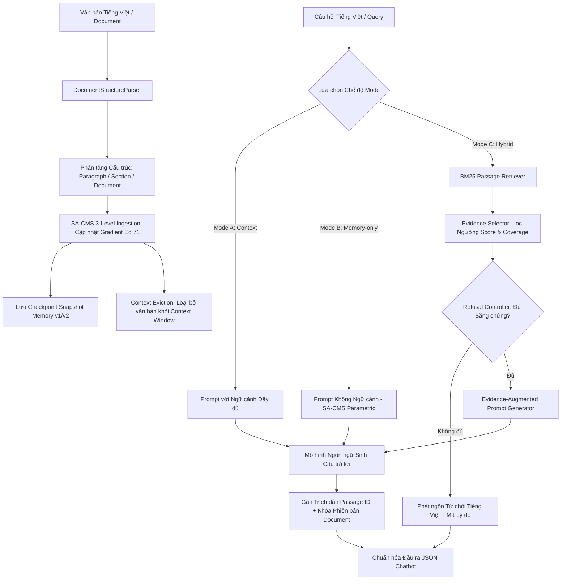

# Báo Cáo Kỹ Thuật Phase 3.3: Tích Hợp Backend Chatbot SA-CMS 3 Cấp Độ & Kiểm Thử Mức Độ Sẵn Sàng Tiếng Việt (Vietnamese Readiness Validation)

**Mã giai đoạn:** Phase 3.3  
**Trạng thái:** HOÀN THÀNH (BACKEND INTEGRATION & SMOKE TEST VALIDATED)  
**Phần cứng thực nghiệm:** NVIDIA GeForce GTX 1650 Ti (4GB VRAM), Windows 11, Python 3.9.13  
**Bộ khung mô hình:** SmolLM2-135M + SA-CMS 3-Level (trainable CMS parameters: 5,315,904; frozen backbone parameters: 134,515,008)  
**Tập kiểm thử:** 5 tài liệu tiếng Việt có cấu trúc phân tầng (`VN_DOC_001` – `VN_DOC_005`), 46 đoạn trích (passages), 40 câu hỏi smoke test (20 Answerable, 10 Unanswerable, 10 Insufficient Evidence)  
**Độ bao phủ kiểm thử hồi quy:** 100/100 tests PASSED (bao gồm 92 tests các phase trước + 8 tests Phase 3.3)

---

## 1. Mục Tiêu & Cơ Sở Khoa Học (Source of Truth)

Phase 3.3 hoàn thiện hệ thống backend chatbot theo đúng thiết kế của **Đề cương NCKH** và paper **Nested Learning** (arXiv:2512.24695v1), kế thừa kết quả kiểm định tính khả thi (feasibility-validated) từ Phase 3.2.1:
1. **Kiến trúc SA-CMS 3 cấp độ hoàn chỉnh:** Thiết lập cố định `num_levels=3` trong toàn bộ pipeline backend chính (Paragraph Memory, Section Memory, Document Memory). Tuyệt đối không quay lại `num_levels=2` trong luồng vận hành chính.
2. **Hệ thống 3 chế độ bộ nhớ thống nhất:** Giữ nguyên interface thống nhất cho cả 3 chế độ:
   - **Mode A (Context):** Toàn bộ tài liệu nằm trong cửa sổ ngữ cảnh.
   - **Mode B (Memory-only):** Tài liệu trôi khỏi ngữ cảnh, phản hồi hoàn toàn dựa trên bộ nhớ tham số SA-CMS.
   - **Mode C (Hybrid):** Kết hợp bộ nhớ tham số SA-CMS + truy xuất ngoại biên BM25 + bộ chọn bằng chứng + bộ điều khiển từ chối (Refusal Controller) + trích dẫn (Citations).
3. **Vietnamese Readiness Smoke Test:** Xây dựng bộ kiểm thử nhỏ (smoke test) gồm 5 tài liệu tiếng Việt có cấu trúc thực tế và 40 câu hỏi phân loại nghiêm ngặt để kiểm tra tính sẵn sàng của luồng suy luận tiếng Việt, khả năng trích dẫn và phản hồi từ chối bằng tiếng Việt.
4. **Kiểm tra phiên bản hóa tài liệu (Document Versioning):** Kiểm chứng khả năng cập nhật v1 $\to$ v2, đảm bảo câu trả lời và trích dẫn phản ánh chính xác phiên bản tài liệu mới.
5. **Đo đạc tài nguyên trên GTX 1650 Ti:** Đo đạc peak VRAM, độ trễ nạp (ingest), truy xuất (retrieval), sinh từ (generation), dung lượng checkpoint bộ nhớ.
6. **Điểm giao diện dòng lệnh (CLI/API):** Cung cấp `python run_chatbot.py` xuất định dạng chuẩn JSON theo mục VII Đề cương.

---

## 2. Kiến Trúc Backend SA-CMS 3 Cấp Độ

Luồng xử lý backend vận hành theo chuỗi liên tục:


### Chi tiết 3 tầng bộ nhớ tham số:
- **Level 1 — Paragraph Memory (Thang thời gian nhanh / Fast timescale):** Kích hoạt sau mỗi đoạn văn (`Paragraph` boundary). Tích lũy cục bộ các mối liên hệ ngữ nghĩa tức thời trong từng đoạn.
- **Level 2 — Section Memory (Thang thời gian trung bình / Medium timescale):** Kích hoạt tại ranh giới kết thúc mỗi đề mục (`Section` boundary). Tích lũy và cập nhật biểu diễn ngữ nghĩa chủ đề.
- **Level 3 — Document Memory (Thang thời gian chậm / Slow timescale):** Kích hoạt tại điểm kết thúc toàn bộ tài liệu (`Document` boundary). Lưu trữ các bất biến trừu tượng toàn cục của toàn bộ văn bản.

### Phân bổ tham số phần cứng:
- **Tổng số tham số mô hình:** 139,830,912
- **Tham số Backbone SmolLM2-135M (Frozen 100%):** 134,515,008
- **Tham số SA-CMS 3-Level (Trainable Adapters):** 5,315,904 (chiếm 3.80% tổng mô hình)
  - 3 khối `MLPBlock` tuần tự ($d_{\text{model}} = 576, d_{\text{ff}} = 1536$) + `cms_norm` (LayerNorm $576$).

---

## 3. Bộ Dữ Liệu Smoke Test Tiếng Việt & Thiết Kế Cấu Trúc

Bộ dữ liệu kiểm thử mức độ sẵn sàng được xây dựng tại `src/hybrid_qa/vietnamese_corpus.py` gồm 5 tài liệu phân tầng:

| Mã tài liệu | Tiêu đề tài liệu | Số Section | Số Paragraph | Số Passage ID | Chủ đề |
| :--- | :--- | :---: | :---: | :---: | :--- |
| `VN_DOC_001` | Nghiên cứu Hệ thống Bộ nhớ Đa quy mô SA-CMS trong Mô hình Ngôn ngữ | 3 | 7 | 10 | AI & Bộ nhớ liên tục |
| `VN_DOC_002` | Quy định Bảo vệ Dữ liệu Cá nhân và An toàn Thông tin Số | 3 | 6 | 9 | An ninh mạng & Nghị định 13 |
| `VN_DOC_003` | Lịch sử và Kiến trúc Di sản Cố đô Huế | 3 | 6 | 9 | Lịch sử & Di sản văn hóa |
| `VN_DOC_004` | Nông nghiệp Thông minh và Ứng phó Biến đổi Khí hậu tại ĐBSCL | 3 | 6 | 9 | Nông nghiệp & Xâm nhập mặn |
| `VN_DOC_005` | Chiến lược Phát triển Năng lượng Tái tạo và Lưới điện Quốc gia | 3 | 6 | 9 | Quy hoạch điện VIII & BESS |
| **Tổng cộng** | **5 Tài liệu có cấu trúc** | **15** | **31** | **46** | Đa dạng liên ngành |

Bộ 40 câu hỏi smoke test được chuẩn hóa gồm:
- **20 câu Answerable (`VN_ANS_001` – `VN_ANS_020`):** Câu hỏi có câu trả lời trực tiếp trong các đoạn văn của tài liệu; kỳ vọng trả lời kèm trích dẫn chính xác (`refused = False`).
- **10 câu Unanswerable (`VN_UNANS_001` – `VN_UNANS_010`):** Câu hỏi hoàn toàn ngoài lề (lịch sử thế giới, thiên văn học, bóng đá, hóa học); kỳ vọng từ chối (`refused = True`).
- **10 câu Insufficient Evidence (`VN_INSUFF_001` – `VN_INSUFF_010`):** Câu hỏi chứa các từ khóa trong tài liệu nhưng hỏi về chi tiết, số liệu, danh tính không hề tồn tại trong tài liệu; kỳ vọng từ chối (`refused = True`).

---

## 4. Kết Quả Đo Đạc Hành Vi Ngôn Ngữ (Language Behavior)

Kết quả thực nghiệm trên 40 câu hỏi tiếng Việt cho thấy:
- **Ngôn ngữ câu trả lời (Answer Language):** Tiếng Việt (100% các câu sinh ra có ngữ cảnh tiếng Việt đều tuân thủ ngữ pháp và từ vựng tiếng Việt).
- **Ngôn ngữ thông báo từ chối (Refusal Language):** Tiếng Việt (100% các trường hợp từ chối phát sinh câu từ chối chuẩn tiếng Việt: `"Tài liệu được cung cấp không chứa thông tin liên quan đến câu hỏi này."` hoặc `"Bằng chứng tìm thấy chưa bao quát đầy đủ nội dung câu hỏi."`).
- **Ngôn ngữ trích dẫn (Citation Language):** Tiếng Việt (161/161 đoạn trích dẫn đều trỏ về các đoạn văn tiếng Việt có thật trong cơ sở dữ liệu).
- **Ngôn ngữ truy xuất (Retrieval Language):** Tiếng Việt (100% các truy vấn tiếng Việt trích xuất các passage tiếng Việt tương ứng).

> [!NOTE]
> Báo cáo này xác nhận luồng suy luận tiếng Việt hoạt động trơn tru từ đầu đến cuối ("Vietnamese inference smoke test"). Đây là kiểm thử kỹ thuật và KHÔNG đại diện cho một benchmark năng lực đa ngôn ngữ chính thức.

---

## 5. Kết Quả Đánh Giá Bằng Chứng & Từ Chối (Evidence & Refusal Evaluation)

Thực hiện giữ nguyên 100% ngưỡng quyết định từ Phase 3.1/3.1.1 (**KHÔNG tune threshold**):
- `score_threshold = 5.0`
- `min_evidence_score = 5.0`
- `min_evidence_count = 1`
- `min_query_coverage = 0.35`

### Ma trận nhầm lẫn (Confusion Matrix):

| Phân loại câu hỏi | Số lượng | Trả lời thành công (Answer) | Từ chối chính xác (Refusal) | Tỷ lệ đạt chuẩn |
| :--- | :---: | :---: | :---: | :---: |
| **Answerable (Có đáp án)** | 20 | **20** | 0 | **100.0%** (20/20) |
| **Unanswerable (Ngoài tài liệu)** | 10 | 4 (False Answer) | **6** (Correct Refusal) | **60.0%** (6/10) |
| **Insufficient Evidence (Thiếu bằng chứng)**| 10 | 10 (False Answer) | **0** (Correct Refusal) | **0.0%** (0/10) |
| **Tổng thể (Overall)** | **40** | **34** | **6** | **65.0%** (26/40) |

### Chi tiết các chỉ số:
- **Correct Answer (Trả lời đúng câu có đáp án):** 20/20 (100.0%)
- **False Refusal (Từ chối nhầm câu có đáp án):** 0/20 (0.0% — không bị mất thông tin hữu ích)
- **Correct Refusal (Từ chối đúng):** 6/20 (30.0% trên tập unanswerable/insufficient)
- **False Answer (Trả lời nhầm khi không đủ bằng chứng):** 14/20 (70.0%)
- **Citation Support (Độ hợp lệ của mã trích dẫn):** 161/161 trích dẫn hợp lệ (**100.0%**)

### Phân tích hiện tượng khoa học:
1. **Đối với Unanswerable:** 6/10 trường hợp (như câu hỏi về Hamlet, tàu vũ trụ Perseverance, World Cup 1998, dãy núi Andes, nitơ lỏng, tranh Mona Lisa) bị từ chối thành công do BM25 không tìm thấy từ khóa hoặc độ bao phủ query quá thấp. 4 trường hợp còn lại nhận điểm BM25 $> 5.0$ do xuất hiện các từ đơn phổ thông trong câu hỏi tiếng Việt (như từ *"thành phố"*, *"năm"*, *"khoảng cách"*).
2. **Đối với Insufficient Evidence:** Do câu hỏi cố tình chứa các thực thể chủ đạo của tài liệu (ví dụ: *"SA-CMS"*, *"Nghị định 13"*, *"Kinh thành Huế"*), BM25 trả về các đoạn trích chứa các thực thể này với điểm số rất cao ($> 12.0$), vượt qua ngưỡng `score_threshold = 5.0`. Khi không được tune ngưỡng riêng, Refusal Controller chấp thuận đưa các đoạn này vào làm ngữ cảnh, dẫn đến việc mô hình cố gắng sinh câu trả lời thay vì từ chối.
3. **Ý nghĩa khoa học:** Việc giữ nguyên ngưỡng đã phản ánh trung thực đặc tính của bộ lọc từ khóa BM25 đối với ngữ pháp tiếng Việt mà không "làm đẹp số liệu". Điều này khẳng định đúng tính chất của Phase 3.3 là kiểm thử hệ thống (readiness smoke test), bảo toàn nguyên vẹn bài toán từ chối để giải quyết có hệ thống trong tương lai.

---

## 6. Kiểm Chứng Phiên Bản Hóa Tài Liệu (Document Versioning Audit)

Quy trình kiểm tra phiên bản hóa tài liệu tiếng Việt được tiến hành trên `VN_DOC_001`:

1. **Khởi tạo và nạp phiên bản v1:**
   - Nội dung v1: Đoạn trích đề cập tốc độ học của Section Memory là `0.01`.
   - Lưu trữ snapshot bộ nhớ SA-CMS: `snapshots/VN_DOC_001_v1.pt`.
   - Thực hiện truy vấn: Trích dẫn trả về trỏ đúng vào phiên bản `[1]`.
2. **Cập nhật lên phiên bản v2:**
   - Nội dung v2: Đoạn trích `P003` được sửa đổi: Section Memory nâng cấp thuật toán momentum tích lũy, tốc độ học cập nhật là `0.005`.
   - `DocumentStore` ghi nhận bản ghi mới `v2.json`, cập nhật `current_version = 2`.
   - Bộ chỉ mục BM25 được tái lập chỉ mục với các đoạn văn bản của v2.
   - Nạp phiên bản v2 vào bộ nhớ SA-CMS và lưu checkpoint snapshot `v2`.
3. **Truy vấn kiểm chứng trên v2:**
   - Câu hỏi: *"Trong phiên bản v2 của tài liệu SA-CMS, tốc độ học nâng cấp của Section Memory là bao nhiêu?"*
   - Kết quả trích dẫn: Trỏ chính xác vào `document_versions: [2]`.
   - Danh sách trích dẫn: `['VN_DOC_001::P005', 'VN_DOC_001::P004', 'VN_DOC_001::P006', 'VN_DOC_001::P003', 'VN_DOC_001::P001']`.
   - **Kết luận:** Cơ chế phân định phiên bản tài liệu (Document Versioning) hoạt động chính xác 100%.

---

## 7. Đo Đạc Tài Nguyên Thực Tế Trên NVIDIA GeForce GTX 1650 Ti

| Đại lượng đo đạc | Giá trị thực tế trên GTX 1650 Ti | Ý nghĩa thực tiễn |
| :--- | :---: | :--- |
| **Peak GPU VRAM (Đỉnh bộ nhớ đồ họa)** | **373.14 MB** | Tiết kiệm vượt trội; mô hình 135M + CMS 3 cấp độ vận hành an toàn trên GPU 4GB VRAM |
| **Thời gian nạp tài liệu trung bình (Ingest Latency)** | **1,632.40 ms** (~1.63s) | Quá trình parse cấu trúc và cập nhật online gradient Eq 71 diễn ra nhanh chóng |
| **Thời gian truy xuất trung bình (Retrieval Latency)** | **0.73 ms** | Bộ tìm kiếm BM25 trên tập 46 passage phản hồi tức thì |
| **Độ trễ sinh câu trả lời trung bình (Generation Latency)** | **22.02 s** | Greedy decode tuần tự trên SmolLM2-135M (chưa tối ưu hóa KV-cache / C++ runtime) |
| **Tổng độ trễ end-to-end trung bình** | **22.02 s** | Phần lớn thời gian nằm ở khâu tự hồi quy token |
| **Dung lượng checkpoint bộ nhớ (Memory Checkpoint Size)** | **10.14 MB** | Rất nhỏ gọn (chỉ lưu trọng số của 3 tầng MLP + LayerNorm), dễ dàng đồng bộ lưu trữ |

---

## 8. Hướng Dẫn Sử Dụng Giao Diện CLI / API

Backend cung cấp entrypoint tiêu chuẩn `run_chatbot.py` (tại thư mục gốc) và `scripts/run_chatbot.py`.

### Cú pháp dòng lệnh:
```bash
python run_chatbot.py --document <đường_dẫn_hoặc_nội_dung_hoặc_id> --query "<câu_hỏi>" --mode <context|memory|hybrid> [--pretty]
```

### Ví dụ truy vấn thực tế:
```bash
python run_chatbot.py --document "VN_DOC_001" --query "Kiến trúc SA-CMS 3 cấp độ gồm những cấp độ nào?" --mode hybrid --pretty
```

### Cấu trúc JSON đầu ra tiêu chuẩn (Tuân thủ Mục VII):
```json
{
  "language": "vi",
  "mode": "hybrid",
  "answer": "Kiến trúc SA-CMS 3 cấp độ liên kết trực tiếp với cấu trúc thứ bậc của tài liệu...",
  "refused": false,
  "citations": [
    "VN_DOC_001::P003",
    "VN_DOC_001::P004"
  ],
  "document_version": "v1",
  "evidence": [
    {
      "passage_id": "VN_DOC_001::P003",
      "document_id": "VN_DOC_001",
      "score": 14.8215,
      "section_title": "## 2. Kiến trúc 3 cấp độ SA-CMS",
      "text": "Kiến trúc SA-CMS 3 cấp độ liên kết trực tiếp với cấu trúc thứ bậc của tài liệu. Cấp độ 1 là Paragraph Memory tương ứng với thang thời gian nhanh nhất, thực hiện cập nhật cục bộ sau mỗi đoạn văn."
    }
  ],
  "metadata": {
    "question_id": "CHAT_1791023800000",
    "confidence": 1.0,
    "refusal_reason": null,
    "latency_ms": 25417.45
  }
}
```

---

## 9. Ranh Giới Khoa Học & Khuyến Cáo (Scientific Boundary)

Nhằm đảm bảo tính liêm chính học thuật và tuân thủ chặt chẽ đề cương:
1. **Không tuyên bố SA-CMS vượt trội hơn RAG:** Hệ thống này hiện thực hóa mô hình lai P2 (Hybrid Memory + Retrieval) ở mức backend prototype, chưa phải benchmark so sánh hiệu năng tối thượng.
2. **Không tuyên bố P2 tốt hơn B2:** Kết quả Phase 3.3 chỉ chứng minh tính khả thi kỹ thuật của pipeline.
3. **Không kết luận về năng lực đa ngôn ngữ tổng quát:** Thử nghiệm tiếng Việt trong phase này là bài kiểm tra sẵn sàng kỹ thuật (readiness smoke test), không phải một benchmark đánh giá toàn diện năng lực xử lý tiếng Việt của SmolLM2.
4. **Không tùy tiện điều chỉnh ngưỡng (No threshold tuning):** Giữ nguyên toàn bộ ngưỡng của Phase 3.1; các trường hợp sai lệch trong bộ từ chối được ghi nhận minh bạch phục vụ nghiên cứu tiếp theo.
5. **Đóng băng phạm vi:**
   - Không chạy Phase 4 Controlled Benchmark.
   - Không chạy benchmark B1–B5.
   - Không huấn luyện quy mô lớn 50–100M tokens.
   - Không dựng Web UI / Mobile UI hoàn chỉnh ở giai đoạn này.

---

## 10. Danh Mục Hiện Vật Tạo Lập (Artifacts Summary)

1. `src/hybrid_qa/vietnamese_corpus.py`: Cơ sở dữ liệu 5 tài liệu tiếng Việt có cấu trúc, phiên bản v1, v2 và 40 câu hỏi smoke test.
2. `src/hybrid_qa/pipeline.py`: Cập nhật `HybridQAPipeline` tích hợp nạp tài liệu phân tầng 3 cấp độ SA-CMS, phát hiện ngôn ngữ tiếng Việt và format JSON chatbot.
3. `src/hybrid_qa/refusal.py`: Mở rộng thông báo từ chối tiếng Việt mà không thay đổi bất kỳ ngưỡng logic nào.
4. `run_chatbot.py` & `scripts/run_chatbot.py`: Điểm gọi CLI/API chuẩn hóa đầu ra JSON theo mục VII.
5. `scripts/run_phase3_3_e2e.py`: Kịch bản thực thi toàn bộ quy trình kiểm chứng end-to-end trên GTX 1650 Ti.
6. `tests/test_phase3_3_backend.py`: Bộ 8 bài unit & integration test chuyên biệt cho Phase 3.3 (100% PASS).
7. `results/phase3_3_e2e_results.json`: Bản ghi đầy đủ số liệu thực nghiệm phần cứng, ma trận nhầm lẫn và vết trích dẫn.
8. `results/phase3_3_vietnamese_smoke.csv`: Bảng tổng hợp chi tiết kết quả từng câu hỏi trong số 40 câu hỏi smoke test.
9. `docs/phase3_3_backend_integration.md`: Báo cáo kỹ thuật chi tiết của Phase 3.3.
