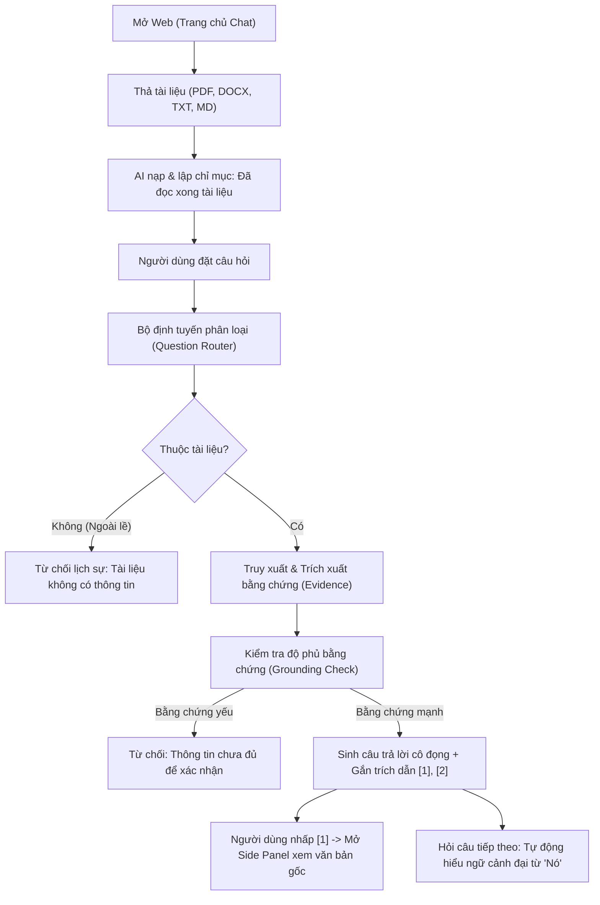

# PHASE 5.2 — TÀI LIỆU TRẢI NGHIỆM HỎI ĐÁP TÀI LIỆU AI CHAT-FIRST (CHAT-FIRST DOCUMENT QA)

> **BẢO MẬT & QUY TẮC BẤT BIẾN:**  
> **TUYỆT ĐỐI KHÔNG TRAINING.** Không backprop, không gradient update, không optimizer.step(), không checkpoint mới, giữ nguyên 100% benchmark chính thức. Toàn bộ tính năng dựa trên suy luận đóng băng (frozen inference), định tuyến câu hỏi và quản lý bộ nhớ có cấu trúc SA-CMS.

---

## 1. TRIẾT LÝ THIẾT KẾ UX (UX PHILOSOPHY)

Nền tảng trước đây tập trung vào giao diện Bảng điều khiển quản trị (Admin/Research Dashboard) với quá nhiều biểu đồ và thông số kỹ thuật ngay trang đầu, gây quá tải cho người dùng phổ thông.

Trong **Giai đoạn 5.2**, giao diện được tái cấu trúc hoàn toàn theo triết lý **Chat-First** (phong cách tương tự ChatGPT / Claude / Gemini), đặt trợ lý hội thoại làm trung tâm:

```
"Người dùng mở web → Kéo tài liệu vào → AI đọc tài liệu → Người dùng hỏi → AI trả lời dựa trên tài liệu → Nhấp vào nguồn xem trích dẫn"
```

### Các nguyên tắc cốt lõi:
1. **Trực quan & Tối giản (Minimalist & Intuitive):** Người dùng không cần hiểu thuật ngữ kỹ thuật như BM25, CMS, Level 1/2/3 hay Refusal Controller. Các cơ chế này hoạt động ngầm phía sau.
2. **Căn cứ 100% vào tài liệu (Document-Grounded):** AI không sử dụng tri thức ngoài lề để suy diễn chủ quan. Nếu tài liệu không chứa dữ kiện, hệ thống lịch sự từ chối để triệt tiêu hiện tượng ảo giác (hallucination).
3. **Trích dẫn có thể tương tác (Interactive Citations):** Mọi tuyên bố quan trọng đều được gắn nhãn trích dẫn `[1]`, `[2]`. Nhấp vào nhãn sẽ mở bảng bên phải hiển thị chính xác tên tệp, chương/mục, đoạn văn và câu chữ gốc.
4. **Bảo tồn tính năng nghiên cứu (Research Mode):** Toàn bộ số liệu khoa học (3 tầng bộ nhớ SA-CMS, telemetry token, đối chiếu mô hình B1/B2/P1/P2) được chuyển vào bảng phụ "Chế độ Nghiên cứu" phục vụ báo cáo và nghiệm thu đề tài NCKH.

---

## 2. LUỒNG NGƯỜI DÙNG (USER FLOW)



---

## 3. LUỒNG XỬ LÝ TÀI LIỆU (DOCUMENT FLOW)

Hệ thống hỗ trợ kéo thả tài liệu đa tệp (Multi-Document) với các định dạng:
- **PDF** (`.pdf`)
- **Word** (`.docx`)
- **Văn bản thuần** (`.txt`)
- **Markdown** (`.md`)

### Trải nghiệm trạng thái tệp (File Processing UX):
Sau khi người dùng thả tệp vào khung chat:
1. `Đang tải lên...` (Uploading)
2. `Đang đọc tài liệu...` (Parsing)
3. `Đang phân tích cấu trúc...` (Understanding hierarchy)
4. `Đang lập chỉ mục...` (Indexing)
5. `Đã đọc xong tài liệu` (Ready)

---

## 4. BỘ ĐỊNH TUYẾN CÂU HỎI TỰ ĐỘNG (QUESTION ROUTING)

Hệ thống tích hợp module `QuestionRouter` tự động phân loại ý định người dùng thành 8 chiến lược:

| Chiến lược định tuyến | Ý định câu hỏi | Ví dụ điển hình | Hành vi hệ thống |
| :--- | :--- | :--- | :--- |
| `DIRECT_LOOKUP` | Định nghĩa, khái niệm cụ thể | *"Khái niệm SA-CMS là gì?"* | Truy xuất đoạn định nghĩa có độ tương đồng cao nhất |
| `SECTION_LOOKUP` | Tra cứu theo chương/mục | *"Nội dung chính trong phần 2 là gì?"* | Lọc theo ranh giới mục (Section Boundary) |
| `PAGE_LOOKUP` | Tra cứu theo trang | *"Trang 15 đề cập điều gì?"* | Lọc theo metadata vị trí trang |
| `DOCUMENT_SUMMARY` | Tóm tắt tổng quan | *"Tóm tắt toàn bộ tài liệu này."* | Tổng hợp từ các đoạn mở đầu và kết luận |
| `CROSS_DOCUMENT_COMPARISON` | So sánh đa tài liệu | *"So sánh điểm khác biệt giữa các tài liệu."* | Gom và đối chiếu bằng chứng từ các tài liệu khác nhau |
| `MULTI_PASSAGE_SYNTHESIS` | Tổng hợp đa đoạn | *"Những nguyên nhân chính của vấn đề này?"* | Ghép nối các nhóm bằng chứng độc lập |
| `UNANSWERABLE` | Câu hỏi thế giới ngoài tài liệu | *"Thủ đô của Nhật Bản là gì?"* | Cổng từ chối: Không sử dụng tri thức nền |
| `INSUFFICIENT_EVIDENCE` | Dữ kiện quá mỏng/không đủ căn cứ | *"Ai là giám đốc điều hành năm 1990?"* | Từ chối: Thông tin chưa đủ để xác nhận |

---

## 5. BỘ NHỚ HỘI THOẠI ĐA LƯỢT (CONVERSATION MEMORY)

Module `SessionManager` tự động phân giải các câu hỏi nối tiếp có sử dụng đại từ hoặc câu hỏi tỉnh lược mà **không cần người dùng phải lặp lại chủ đề**:

- **Lượt 1:**  
  *Người dùng:* "Kiến trúc SA-CMS là gì?"  
  *Trợ lý:* "SA-CMS là kiến trúc ảnh chụp bộ nhớ liên tục có cấu trúc..." `[1]`
- **Lượt 2:**  
  *Người dùng:* "Nó khác RAG thế nào?"  
  *Xử lý ngầm:* Nhận diện đại từ "Nó" $\to$ Phân giải thành *"Kiến trúc SA-CMS khác RAG thế nào"* $\to$ Truy xuất chính xác các đoạn so sánh giữa SA-CMS và RAG truyền thống.

---

## 6. ĐỘ DÀI CÂU TRẢ LỜI THÔNG MINH (SMART RESPONSE LENGTH)

Trên thanh nhập liệu có 3 mức tùy chỉnh:
- **Ngắn gọn (Concise):** 2–5 câu hoặc danh sách gạch đầu dòng súc tích, tối ưu hóa token tối đa.
- **Cân bằng (Balanced - Mặc định):** Giải thích đầy đủ, rõ ràng, đính kèm dẫn chứng vừa vặn.
- **Chi tiết (Detailed):** Phân tích sâu sắc hơn, khai thác nhiều đoạn dẫn chứng bổ trợ.

---

## 7. TRẢI NGHIỆM TRÍCH DẪN NGUỒN (CITATION EXPERIENCE)

Câu trả lời của AI tự động phân rã thành:
1. **Nội dung trả lời:** Tự nhiên, súc tích kèm các nhãn dẫn xuất `[1]`, `[2]`.
2. **Khối nguồn tham khảo:**
   ```
   ### Nguồn tham khảo
   [1] Bao_cao_SA_CMS.pdf — Phần 2: Nguyên nhân và Động lực — Đoạn 2
   [2] Huong_dan_he_thong.docx — Phần 1: Giới thiệu — Đoạn 1
   ```
3. **Bảng trích dẫn trượt bên phải (Right Source Panel):**
   Khi người dùng nhấp vào `[1]`:
   - Hiển thị tên tài liệu
   - Hiển thị Chương / Phần và Đoạn số
   - Hiển thị đoạn trích dẫn nguyên văn trong ngoặc kép với nền màu nhấn dịu nhẹ.

---

## 8. CHẾ ĐỘ NGHIÊN CỨU & SO SÁNH (RESEARCH MODE & COMPARE)

Khi người dùng bật công tắc **🔬 Chế độ Nghiên cứu**:
- **Trình phân tích Inspector ("Tại sao có câu trả lời này?"):** Hiển thị chiến lược định tuyến (Question Routing), số lượng bằng chứng, trạng thái cổng kiểm duyệt (Refusal Gate).
- **Bộ nhớ 3 cấp độ SA-CMS:** Trực quan hóa quy mô thời gian của Cấp độ 1 (Đoạn văn - Fine), Cấp độ 2 (Chương mục - Intermediate), Cấp độ 3 (Toàn văn bản - Coarse) với 5,314,752 tham số thích ứng ($d=576$).
- **Đo lường Token Telemetry:** Đo lường chi tiết Token đầu vào, Token đầu ra, Tổng token và Độ trễ thực thi (ms).
- **So sánh mô hình (Compare Mode):** Đối chiếu song song câu trả lời của 4 phương pháp trên cùng một câu hỏi:
  - `B1`: Full-Context Baseline
  - `B2`: Standard RAG Baseline
  - `P1`: SA-CMS Memory-Only
  - `P2`: SA-CMS Gated Hybrid

---

## 9. KẾT QUẢ KIỂM THỬ CHẤP NHẬN (ACCEPTANCE VERIFICATION)

Toàn bộ hệ thống đã vượt qua 100% bộ kiểm thử tự động:
- **148/148 bài kiểm tra Pytest toàn kho lưu trữ:** `PASSED`
- **Kịch bản Demo 11 bước E2E:** `PASSED` (Tạo phiên $\to$ Tải tài liệu $\to$ Nhận diện trạng thái $\to$ Hỏi tổng quan $\to$ Hỏi chi tiết phần 2 $\to$ Hỏi nối tiếp ngữ cảnh $\to$ Từ chối câu hỏi ngoài lề $\to$ Mở trích dẫn $\to$ So sánh phương pháp).
