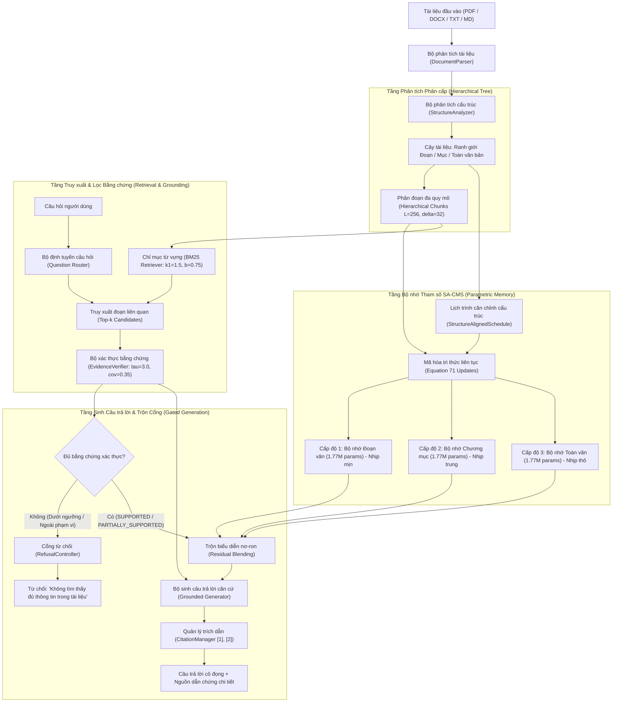
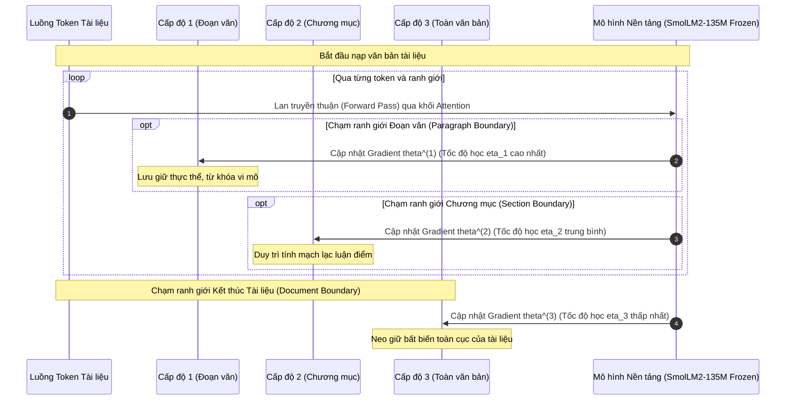
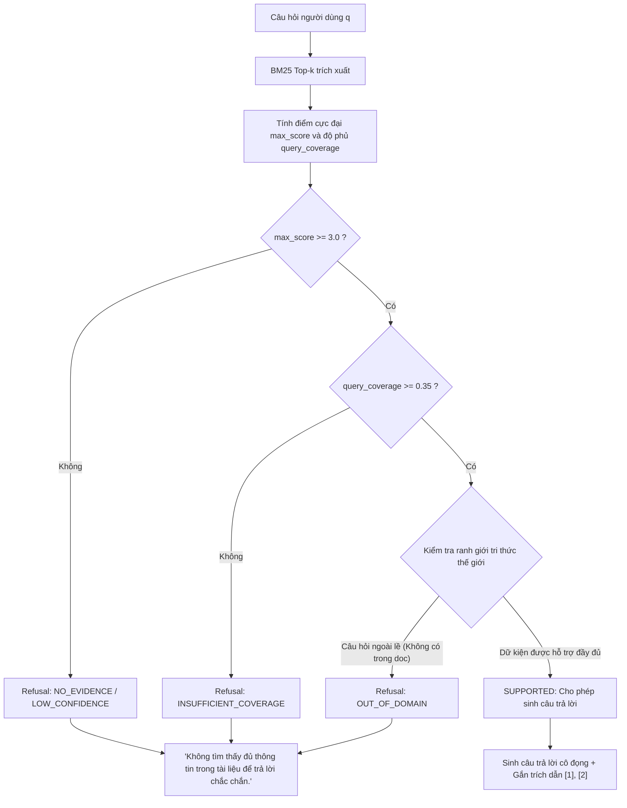

# SƠ ĐỒ KIẾN TRÚC HỆ THỐNG SA-CMS 2.0 (ARCHITECTURE DIAGRAMS)
**Đề tài**: Structure-Aligned Continual Memory System for Long-Document Grounded Question Answering (SA-CMS)  
**Tài liệu dành cho**: Hội đồng Nghiên cứu Khoa học & Báo cáo Luận văn  
**Ngày phát hành**: Tháng 10/2026

---

## 1. SƠ ĐỒ TOÀN CẢNH LUỒNG XỬ LÝ (END-TO-END PIPELINE)

---

## 2. SƠ ĐỒ BỘ NHỚ ĐA QUY MÔ THỜI GIAN (MULTI-TIMESCALE MEMORY DYNAMICS)

---

## 3. SƠ ĐỒ HÒA TRỘN PHẦN DƯ VÀ ĐẦU RA LOGITS (RESIDUAL BLENDING & HIDDEN STATES)

```mermaid
graph LR
    X["Token đầu vào"] --> EMB["Embedding Layer"]
    EMB --> ATTN["Transformer Attention Layers (SmolLM2 Frozen)"]
    ATTN --> H["Biểu diễn ẩn: H_t (d=576)"]
    
    H --> LN["LayerNorm Elementwise"]
    LN --> CMS_CHAIN["Chuỗi MLP Đa tầng SA-CMS: f(3) ∘ f(2) ∘ f(1)"]
    CMS_CHAIN --> M["Phần dư bộ nhớ: M_t (d=576)"]

    H --> ADD["Phép cộng véc-tơ (+)"]
    M --> ADD
    ADD --> H_FINAL["Biểu diễn hòa trộn: H_t + M_t"]
    
    H_FINAL --> LM_HEAD["Language Model Head (Causal Vocab Projection)"]
    LM_HEAD --> LOGITS["Logits phân phối xác suất từ kế tiếp"]
```

---

## 4. QUY TRÌNH KIỂM SOÁT TỪ CHỐI & XÁC THỰC CĂN CỨ (REFUSAL & GROUNDING LOGIC)

